# RedBog Renewables


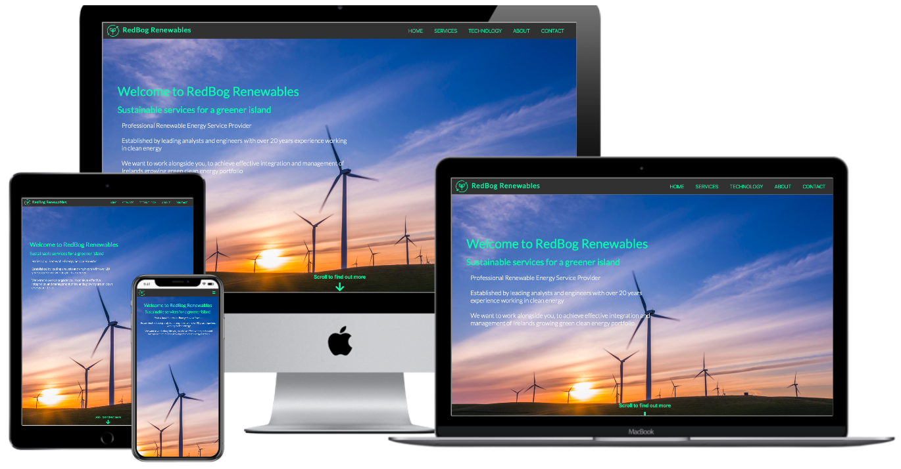

## Code Institute Milestone 1 Project

The project has been undertaken to promote a fictional start-up company named "RedBog Renewables". 
The project aims to give a professional and effective online presence to the start-up company, 
displaying the goals that the organistaion wishes to portray. The website is broken down into distinct
sections that clearly define the services they provide, the technology they utilise and the story of their brand. The basic design is done in a way
that will be familar to the user but showcases the professionalism and modern technology. 
The websites purpose is to present the start-up company as a professional, experienced and modern organisation 
ready to assist in the ever-growing market of renewable energy. 

# Table of Contents:

- [RedBog Renewables](#redbog-renewables)
  * [Code Institute Milestone 1 Project](#code-institute-milestone-1-project)
- [UX](#ux)
  * [User Stories](#user-stories)
  * [Strategy](#strategy)
  * [Scope](#scope)
  * [Structure](#structure)
  * [Skeleton](#skeleton)
    + [**Wireframes**](#--wireframes--)
    + [**Changes to initial wireframes**](#--changes-to-initial-wireframes--)
  * [Surface](#surface)
- [Features](#features)
  * [1. Navigation](#1-navigation)
  * [2. Landing Page](#2-landing-page)
  * [3. Our Services](#3-our-services)
  * [4. Our Renewable Technology](#4-our-renewable-technology)
  * [5. About us / Meet the team](#5-about-us---meet-the-team)
  * [6. Get in touch](#6-get-in-touch)
  * [7. Future Features](#7-future-features)
- [Technologies used](#technologies-used)
  * [Languages](#languages)
  * [Libraries, Frameworks and Technologies](#libraries--frameworks-and-technologies)
  * [Workspace and Version Control](#workspace-and-version-control)
- [Testing](#testing)
  * [Code Validators](#code-validators)
  * [Responsive Elements](#responsive-elements)
  * [UX User Story Test](#ux-user-story-test)
  * [Manual Testing](#manual-testing)
  * [Bugs and Fixes](#bugs-and-fixes)
- [Deployment](#deployment)
  * [Github Pages Deployment:](#github-pages-deployment-)
  * [Forking The Repository:](#forking-the-repository-)
  * [Creating a local clone:](#creating-a-local-clone-)
- [Credits](#credits)
  * [Content](#content)
  * [Media](#media)
  * [Acknowledgements](#acknowledgements)


# UX
## User Stories
----------------
In this project there are three main groups of target users. They include potential customers, prospective employees
and potential investors. The user stories of each group are clearly defined below.

__Applicable to all users__
- As a user, I would like to quickly and effectively understand the purpose of the website.
- As a user, I need to be able to easily navigate the page in a standard format.
- As a user, I would like to know what services the company provide.
- As a user, I need to understand that the company supports the technology relevant to my business or interest.
- As a user, I would like to know about the history and experience of the company.
- As a user, I would appreciate the opportunity to "meet the team", with the ability to know more if I need to.
- As a user, I would like to contact the company, and quickly filter what service or area I am interested in.
- As a user, knowing where the company is located is important, will they be able to provide a service within reasonable time? Are they within a good distance of our location?
- As a user, I would like to use the site on mobile and desktop.  

__Prospective Employee__
- As a prospective job applicant, learning about the company prior to my application is important. 
- As a prospective job applicant, I would like to know that this company is open to recruitment.
- As a prospective job applicant, links to the company social media is important, to find out if the company are active and what their latest news is.

__Potential Investor__
- As a potential investor, I would like to see that the company is a new start-up company, open to investment.
- As a potential investor, I need to see that the company is operating a service in a new emerging marketplace.

__Returning Users__
- As a returning user, I would like to be able to quickly navigate to a specific area of the site. i.e Go directly to the contact page.
- As a returning user, I need to be able to gain more information about relevant services that had not been identified on the first visit to the site.

## Strategy
----------------
__Project goals__

The aim of this project is to build a site for a fictional start-up company and enable the company to create a professional and effective online presence. 
It was important for me to create a user-friendly and modern design site, that in effect inticed the user to discover more about the content
and in turn learn about the company. Overall, it was imperative to display information and content relevant to the company through well structured design,
positive imagery and colour. 

With regard to the content of the site, I aimed to answer four key questions that the company wanted users to be able to answer on landing and navigating the site.
- **_What_** are the services that company provide?
- **_Why_** would we choose this company, are they working within our specific area of expertise? 
- **_How_** will this company help our needs? **_How_** much experience do they have? 
- **_Where_** are the company based, are they operating on the island of Ireland?
 
__User goals__ 

The customer or users goals will be met by answering the questions posed earlier. The users want an informative, responsive and efficient website.
The users want basic information with an opportunity to learn more if they wish. This will be achieved through easily digestible snippets of text, combined 
with modern imagery to re-enforce the information.  

To ensure the natural key users needs are net, the page will be a single-scroll page with fixed navigation to specific areas.
This will be a modern but standard format in order to achieve user goal of an easy-to-use page. 

__Industry Research__

As part of the project conception, a task was undertaken to understand the current trends of web design for companies operating in the field. 
During the research a number of companies were found that provide similar services to the fictional company. They include:

A number of common themes appeared during my research. The sites were simple in design and layout, offering a clear definition 
of the services provided by the company and the relevant fields in which they operated. The sites utilised high quality imagery of large
landscapes and bright colours throughtout their pages. There was simple use of icons and text, with large paragraphs of text avoided.
Throughout the sites there were opportunites to link directly to get in contact or to learn more about the organisation. Some of the sites 
information appeared dis-jointed and the structure of containers asymmetric in design. This aspect of the sites was unappealing as a user, and for that reason I was keen to avoid overly complicated layouts.


## Scope 
----------------

Based on the strategy of the project, a number of practical requirements were laid out. It should be noted, that content in the project is constrained due to the fact that company is fictional
and the depth of knowledge acquired from research of the field is limited. The scope therefore includes:
- Basic and simplified information about the company and the services they provide.
- An overview of energy technology the company is assumed to have an understanding of.
- A brief history and description of the organistaion, with a "Meet the team" section of assumed roles a similar organistion might have.
- A contact form for the company.
- A interactive map of company location.
- Fixed navigation bar for desktop and collapsable burger menu for tablet and mobile.
- Download links for more information.
- Links to relevant social media for senior professional roles and general organisation. 

## Structure
----------------

The structure of the page is formed around a single page scrolling design, with fixed sticky navbar that collapses to burger menu on 
tablet and desktop. The website is split into five separate sections, that are simple to navigate and clear to understand.

1. **Landing Page**
- Simple landing page, with large landscape background image featuring the relevant technology used by the company. 
The content features a simple slogan and a brief description. At the bottom of the page there will be a "scroll to find out more" and interactive arrow icon. 
This feature will intice the user to find out more. 
2. **Our Services**
- This section holds the relevant information that each user-story wants answered. 
The section is introduced by simple paragraph. The services are broken into three respective stand-alone elements.
Interactive hover on sections and a link to download further information.

3. **Our Technology**
- Simple layout of technology the company operates with. Interactive icons and imagery to re-enforce company goals and add to modern user-friendly site.

4. **About Us**
- Two element page, with "About Us" and "Meet the team". The about section outlines the aims of company, the history and the experience the team members have in the industry.
The team area includes the image of the character, their name, title and relevant social media links. The team members only include department heads, as during
research it was found that was the industry norm. 

5. **Get In Touch**
- This section will enable the user to quickly get directly in contact the company for services, careers or investment. 
- The section will also feature an interactive map of the location of the company and links to social media.

6. **Information Architecture**

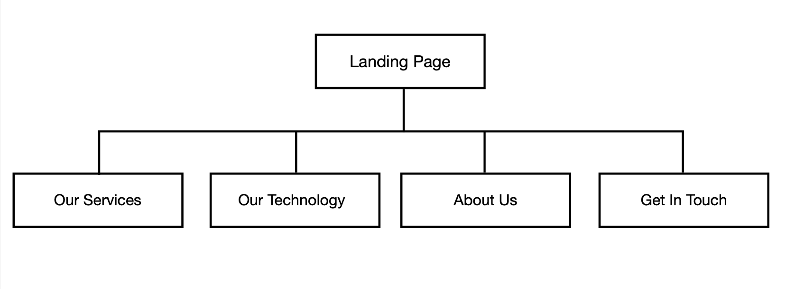

## Skeleton 
----------------
### **Wireframes** ###

The Skeleton of the project design was built utilising [Figma](https://www.figma.com/design-systems/). A detailed design breakdown can be seen [here.](README_images/design_breakdown.png)
The overall basic design breakpoints can be seen below:

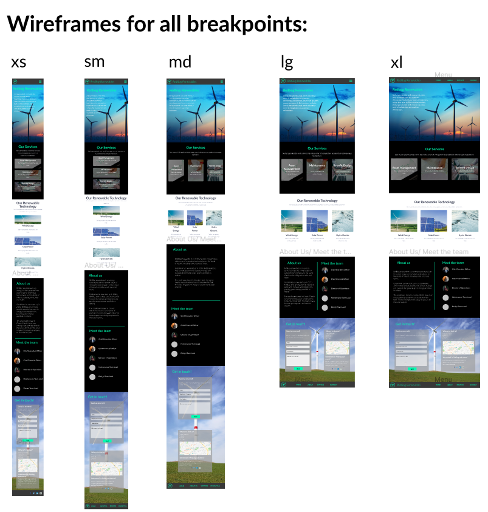

The individual wireframes can be seen by following the links below:
- [Link]
- [Link]
- [Link]

### **Changes to initial wireframes** ###
A number of design edits were made throughout the project with the purpose of increased userability. 
- The 'Our Services' information cards were made that the bulk of text was not immediately available. 
The user would have to reveal more specific information about the service by hovering over each card. 
This ensured the information and content is more disgestable and not overwhelming when the user arrives on the section. 

- The images used in the wireframes were replaced with high quality and more fitting landscape photos.

- The footer was simplified to include only the company logo, social links and copyright information. 

## Surface 
----------------
The look and feel of the site was clear from design conception. The modern feel required a dark toned site with bright punchy colours for 
headings and navigation. The dark background ensured the content and text of the site was clear and discernible from background images or content. 

The company operates in an advanced engineering field with specific reference to the idea of 'green and clean' energy. Therefore, it was important to include the colour green, and it be a significant and prominent
feature of the site. 

**Colour Theme**

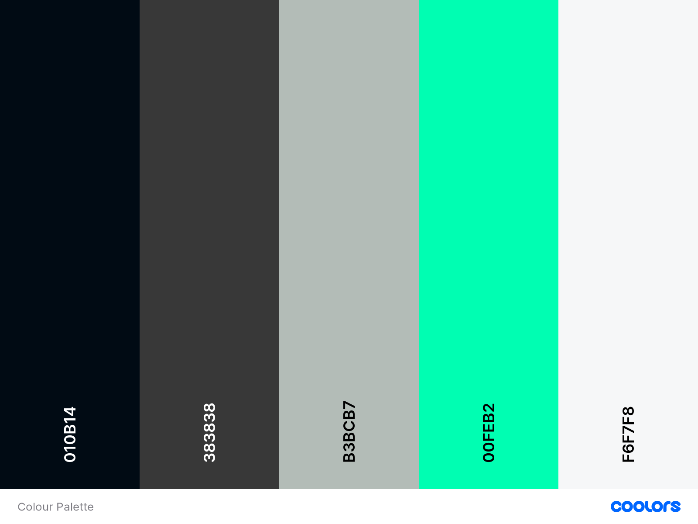

**Typography**


# Features 
----------------

## 1. Navigation
The navigation is a fixed sticky top navbar with links to different sections of the single scroll page. The colour used is 
a dark grey which allows the brand logo and nav items to stand out. The logo and brand name is presented on the far-left side of the navbar and the section
headings on the far right. As the breakpoints decrease, the navbar transitions to a burger menu. The burger menu is a dropdown menu aligned to the right-hand side of the screen. 
To match the theme, the burger menu icon is green #00FEB2. 

I wanted to keep the design simple but interactive. When a user hovers over each nav item the colour fades to a white light colour.
The logo and brand name also act as a nav-link to the landing page, as is standard in modern web-design.

When the navbar is in the collapsed format and the user makes a selection, the page will navigate to the relevant section and
the navigation will close automatically. This was an important feature to add to the project as it supports user-friendly design and
the mobile first concept. I utilised javascript code found [here](link) to complete this task.


----------------
## 2. Landing Page

The landing page features a large landscape photo with wind turbines operating in the background. Immediately the user is aware that
the company specialises in an important type of technology. The user is welcomed by bright bold heading text and a short but effective
slogan underneath. The slogan perfectly defines the important elements the company wishes to portray. 

After the introduction there is some brief text outlining the experience and aims of the company. This is light text and easy to 
disgest for the user. The white colour and font size allows clear reading for the user.

The base of the page features a moving chevron down icon with 'scroll to find out more' text above. This engages the user and adds to 
the website flow and user-friendly design.

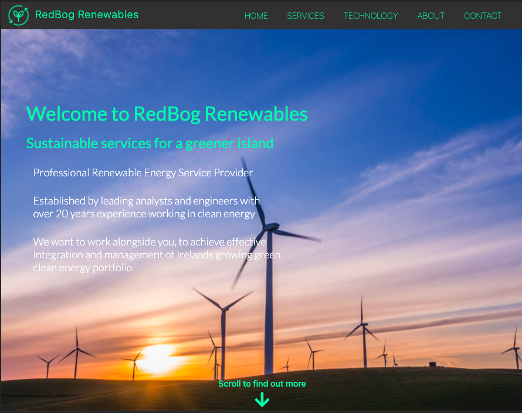

----------------
## 3. Our Services

The key feature of this section is three containers each representing a service of the company. The containers feature the service title
and once hovered over reveal more detailed information about the service.

The service titles have a hint icon in order to suggest the user hover over them. The service description then appears from the base of 
the container. The purpose of this feature was to engage the user with the content and enable the user to learn more about the service
in a consumable way. 

The elements of the page are responsive and the font size and container size chage with different breakpoints.

The basic hover structure was found [here]() and the design heavily edited to fit the sites needs. 

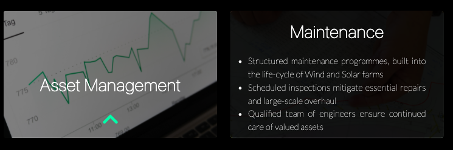

---------------
## 4. Our Renewable Technology

The technology page is a simple, bright and contrasting page to the rest. The purpose of this feature was to simply familarise the
user with the technology that the company has a working profeciency in. The reason for contrasting colour was to break the section apart from
the other sections and perhaps redirect the users attention to the new content on the page. 

The section features three simple bootstrap cards, with bright imagery relevant to the technology description. The cards also feature
animated icons to engage the user. Below the card headings are very brief benefits of the referred technology.

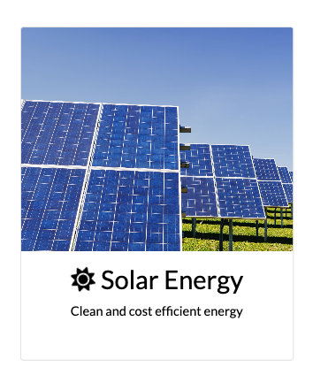

---------------
## 5. About us / Meet the team

This section features a more detailed description of the company, alongside an opportunity to 'meet the team'. The section also feautures a
vertical divider, placed to separate the content and allow the user to focus on a single element at a time. 

The team section features high quality professional photos and the ability to let the user find out more about the team. The team members
relevant social media icons and links are below their titles. The icons feature the hover function and change colour when activated.

The elements of the page are responsive go from side-by-side to vertically aligned at the XXXX breakpoint.

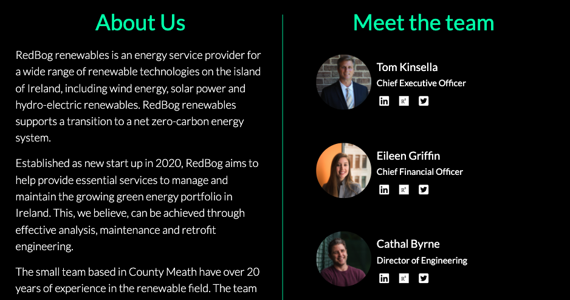

---------------
## 6. Get in touch 

The aim of the contact page is to enable a seemless experience for the user to get a direct-line of communication to the company.
The form is simple, but ensures key information is transmitted to the company. The form features a dropdown selection
menu with the options of each service, careers or investment. There is also a text box which enables the user to get more specific 
with their first contact to the company.

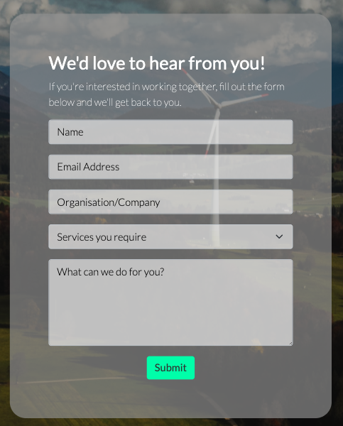

The other container on the contact page focused on the location. Here we have the address of the company
and an interactive google map with location marker. This feature adds to the professionalism and overall 
user experience. Below the map there is another reminder for users to get in contact. This was included 
to redirect users to the form if they had skimmed the page to the bottom. 

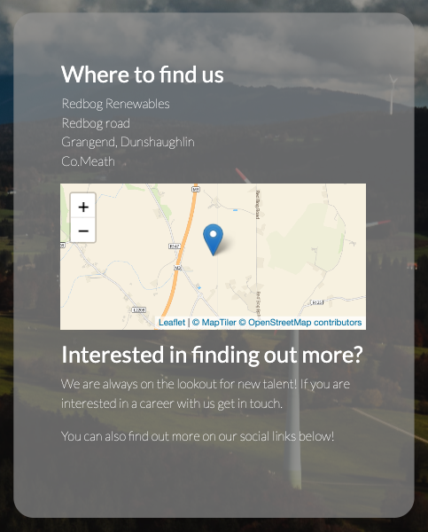

---------------

## 7. Future Features

XXXXXXXXXXXXXXX


# Technologies used
## Languages
---------------
For this project two languages were used:
- [HTML]()
- [CSS]()

## Libraries, Frameworks and Technologies
---------------
- [Bootstrap](https://getbootstrap.com/) - Bootstrap was used to for its wasy to use grid and repsonsive layout. Elelments of the navbar, cards and forms were taken from the Bootstrap V5.0 CDN.

- [Figma](https://www.figma.com/) - Figma was used to create initial design and wireframes for different breakpoints.

- [Logomakr](https://logomakr.com) - The fictional brand logo was created on 'LogoMakr'.

- [Coolors](https://coolors.co) - Used to creat colour palette and test colour themes.

- [Unsplash](https://unsplash.com/) - Used to source high quality images.

- [Google Fonts](https://fonts.google.com/) - Google font 'Lato' was included in the project.

- [Font Awesome]() - All icons used throughout the project come from fontawesome.

- [JQuery](https://jquery.com/) - Used for aspects of userability.

- [Leaflet](https://leafletjs.com/examples/quick-start/) - Leaflet was used for the map in the contact section. Due to my lacking experience with JavaScript, this had to be imported and edited to suit the loction of this project.

- [Maptiler Cloud](https://cloud.maptiler.com/maps/streets/) - Leaflet uses maptiler cloud to tile the map view.

## Workspace and Version Control
--------------------
- [Github](https://github.com/) - The project is hosted on Github and the live website is worked through Github pages.

- [Gitpod](https://www.gitpod.io/) - The project used Gitpod IDE for build and development. 

# Testing 
## Code Validators 
---------------
A number of code validation techniques were utilised to ensure proper testing of site. 
For HTML and CSS, I used the [W3C Markup Validator](https://validator.w3.org) and [W3C CSS Validation Services](https://jigsaw.w3.org/css-validator/). 
These tests returned no errors. See below for results.

- [HTML Test](https://validator.w3.org/nu/?doc=https%3A%2F%2Fbyrnelorcan.github.io%2FMS1-Redbog-Renewables%2F)
- [CSS Test](https://jigsaw.w3.org/css-validator/validator?uri=https%3A%2F%2Fvalidator.w3.org%2Fnu%2F%3Fdoc%3Dhttps%253A%252F%252Fbyrnelorcan.github.io%252FMS1-Redbog-Renewables%252F&profile=css3svg&usermedium=all&warning=0&vextwarning=&lang=en)

A Chrome Developer Tools "Lighthouse" Test was aslo completed to test for accessibility and performance. 
The results are seen below. Initial testing showed a low value of SEO and accessibility. This was rectified by 
adding missing alt labels and adding a meta description. Although, the accessibility number is still below 90,
this is an area I wish to improve on going forward with the design of the site. 

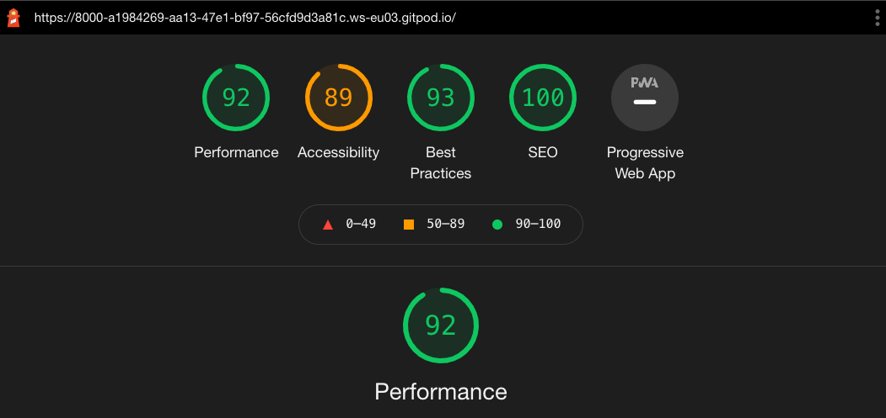

## Responsive Elements 
--------------

The responsivity of the page was tested primarily using [Google Chrome Dev Tools]() and manual resizing of windows. The test provided positive results for each 
device option. The responsive breakpoints and resizing worked throughout the site. The site was shared with colleagues and friends and tested 
on their devices. An error on IOS with images was found through these tests. A fix for that problem is referred to in the relevant section below.

Other tools utilised to test responsivity are seen here:
- [Screenfly](https://bluetree.ai/screenfly/) - [Result](https://bluetree.ai/screenfly/?u=https%3A//byrnelorcan.github.io/MS1-Redbog-Renewables/&a=20&b=10)
- [Responsinator](http://www.responsinator.com) - [Result](http://www.responsinator.com/?url=https%3A%2F%2Fbyrnelorcan.github.io%2FMS1-Redbog-Renewables%2F)
  

## UX User Story Test
--------------
The user stories previously laid out in the UX Design section are tested, to ensure that project achieves the user goals.

__Applicable to all users__
- *As a user, I would like to quickly and effectively understand the purpose of the website.*
   - The user lands on a page with a clear brand welcoming and a slogan that puts emphasis on important aspects to understand about the company.
   "Sustainable Services for a greener island".

- *As a user, I need to be able to easily navigate the page in a standard format.*
   - The fixed sticky navbar allows the user to go directly to the area of the page that is desired. It also enables the user to know exactly where they are on the page, through an active class navbar.
- *As a user, I would like to know what services the company provide.*
   - The services section clearly defines three key services provided by the company, and explains the overlying information the user needs.
- *As a user, I need to understand that the company supports the technology relevant to my business or interest.*
   - It is important that the user knows that the company can only deploy services to a set range of technologies. That aspect is defined in the 'Technology' section.
   It is clear that the company focus is wind, solar and hydro. 
- *As a user, I would like to know about the history and experience of the company.*
   - The about section gives a detailed overview of the company. 
- *As a user, I would appreciate the opportunity to "meet the team", with the ability to know more if I need to.*
   - The user 'meets the team' in the about section. Here the user can interact with the top level employees relevant social media sites.
- *As a user, I would like to contact the company, and quickly filter what service or area I am interested in.*
   - The contact page features a form with an option to select the reaon for contacting the company and a text input to specify details of request or interest.
- *As a user, knowing where the company is located is important, will they be able to provide a service within reasonable time? Are they within a good distance of our location?*
   - An interactive map showing the location of the company is placed in the contact section.
- *As a user, I would like to use the site on mobile and desktop.*
   - The site is fully functional and responsive, with dynamic breakpoints throughout.

__Prospective Employee__
- *As a prospective job applicant, I would like to know that this company is open to recruitment.*
   - The oppurtunity for a career is referred to in the about section and there is a option for 'career' available on the contact form.
- *As a prospective job applicant, links to the company social media is important, to find out if the company are active and what their latest news is.*
   - The footer features links to the company social media and the 'meet the team' sections has links to personal social media.

__Potential Investor__
- *As a potential investor, I would like to see that the company is a new start-up company, open to investment.*
   - This is outlined in the about section of the site. The content makes clear that the company is recently found and open to investment.
- *As a potential investor, I need to see that the company is operating a service in a new emerging marketplace.*
   - This is achieved in the services page and also laid out throughout the site. It is widely known to be evergrowing market, particularly in Ireland. 
   And this aspect is referred to on the landing page and the about section.

__Returning Users__
- *As a returning user, I would like to be able to quickly navigate to a specific area of the site. i.e Go directly to the contact page.*
   - A returnig user can navigate to any section of the page from the sticky navbar. 
- *As a returning user, I need to be able to gain more information about relevant services that had not been identified on the first visit to the site.*
   - The user has the oppurtunity to download an information pack which would provide more detail on services provided. 

## Manual Testing
--------------
**Browser testing** 
- The site was manually tested using different browsers and all except safari ran with no problem. Safari appeared to have a problem
with some of the inline-flex classes. The fix to this is referred to below.

**Funtionality testing**
- All links on the navbar, social media icons and download links were checked throughout the page. 
- All hover transitions and transforms were tested.
- The collapsable navbar was tested and the subsequent automatic closing after selection. This function performed well. 
- The navbar active class scroll was tested and funtioned well after some editing and guidance from my [mentor](https://github.com/omedale).
- The form funtionality was tested and each element that has a 'required' attribute was check. The form functioned well.

The funtionality tests verified that the elements of the required sections performed successfully.

## Bugs and Fixes 
--------------
- *Error in background image sizing on IOS devices:*
   - The fix was found by setting a media-query with CSS class: `background-attachment: scroll;` for the respective screen widths.

- *Error in Safari browser `d-inline-flex` class:*
   - A fix was to simplify the classes and select `col-12` full widths on the areas where there was placement error.

- *Active navbar class not displaying at correct point:*
   - The code for this section is attributed below. 
   - With assistance from my tutor a fix was found to offset the point of activation. 
   - ```JavaScript 
      if ( $('#'+sections[i]).offset().top - ($(sections[i]) !== 'head' ? 50 : 0) 
      <= $(window).scrollTop() ) {

# Deployment 

## Github Pages Deployment:
The project is deployed to GitHub Pages. To deploy the site follow the instruction below.
1. In GitHub navigate to the [MS1 RedBog Renewables Repository](https://github.com/byrnelorcan/MS1-Redbog-Renewables).
2. Locate '_Settings_', navigate to '_Source_' and select _Master Branch_ from the dropdown and click _Save_.
3. The site will be published and confirmation shown on the page.

## Forking The Repository:
To create a fork of the Repository simply:
1. Navigate to the [MS1 RedBog Renewables Repository](https://github.com/byrnelorcan/MS1-Redbog-Renewables).
2. Select '_Fork_' on the right hand corner of the page.

## Creating a local clone:
1. In GitHub navigate to the [MS1 RedBog Renewables Repository](https://github.com/byrnelorcan/MS1-Redbog-Renewables).
2. Above the file list select '_Code_' with the download icon. 
3. To clone select the copy icon at the far right side of URL.
4. Open your terminal in respective IDE, and edit working directory to the desired location.
5. Type `git clone` and paste copied URL.
6. Select Enter and local clone will be created. 

For more specific information relating to the clone follow this [link](https://docs.github.com/en/github/creating-cloning-and-archiving-repositories/cloning-a-repository)

# Credits 
## Content
--------------
- The structure of the site came from [Bootstrap Documentation V5.0.](https://getbootstrap.com/docs/5.0/getting-started/introduction/)
- The services hover animation was based on code found from [Bootsrapious - Hover](https://bootstrapious.com/p/bootstrap-image-hover).
- The pulse and bounce animation found on the landing and technology pages is Gubi's code found here: [Pulse and Bounce.](https://gist.github.com/gubi/8483199)
- The 'Fade in' effect on the landing page is from Peter Mortensen and can be found on [Stack Overflow.](https://stackoverflow.com/questions/11679567/using-css-for-a-fade-in-effect-on-page-load)
- The map found on the contact page utilised [Leaflet JS](https://leafletjs.com/examples/quick-start/) and [Maptiler](https://cloud.maptiler.com/). The tutorial used to implement that code can be found [here](https://www.youtube.com/watch?v=wVnimcQsuwk).
- The Collapsing Navbar is from Zim and can be found on [Stack Overflow.](https://stackoverflow.com/questions/42401606/how-to-hide-collapsible-bootstrap-4-navbar-on-click)
- The active Navbar and Scrollspy function is from 'ambitstream' and can been seen [here.](https://gist.github.com/ambitstream/e69f9937fc0f2e22688425f8ecfe5a19)
- Smaller content is credited in the HTML and CSS directly in the project. 
## Media 
--------------
- The images via [Unsplash](https://unsplash.com/) used throughout the site are credited below:
   - Photo of contact page [Wind Turbine](https://unsplash.com/photos/v38KKZvmT_g) by [Artiom Vallat](https://unsplash.com/@virussinside)
   - Photo of technology card [Hydroplant](https://unsplash.com/photos/w6X7XaolqA0) by [Dan Meyers](https://unsplash.com/@dmey503)
   - Photo of team member [Engineer 2](https://unsplash.com/photos/IU10leGdwxg) by [Science in HD](https://unsplash.com/@scienceinhd)
   - Photo of technology card [Solar Plant](https://unsplash.com/photos/V4ZYJZJ3W4M) by [Zbynek Burival](https://unsplash.com/@zburival)
   - Photo of landing page [Wind Turbine in sunset](https://unsplash.com/photos/4y2TkE8NYXY) by [RawFilm](https://unsplash.com/@rawfilm)
   - Photo of technology card [Wind turbine in a field](https://unsplash.com/photos/JRUVbgJJTBM) by [Thomas Reaubourg](https://unsplash.com/@thomasreaubourg)
   - Photo of team member [CEO](https://unsplash.com/photos/sgZX15Da8YE) by [Shipman Northcutt](https://unsplash.com/@shipnorth)
   - Photo of team member [CFO](https://unsplash.com/photos/0Zx1bDv5BNY) by [Christina](https://unsplash.com/@wocintechchat)
   - Photo of team member [Human Resources](https://unsplash.com/photos/SJvDxw0azqw) by [Christina](https://unsplash.com/@wocintechchat)
   - Photo of services card [Design](https://unsplash.com/photos/5fNmWej4tAA) by [Scott Graham](https://unsplash.com/@homajob)
   - Photo of services card [Asset Management](https://unsplash.com/photos/IrRbSND5EUc) by [Markus Winkler](https://unsplash.com/@markuswinkler)
   - Photo of services card [Maintenance](https://unsplash.com/photos/mWc8xsxFCLc) by [Thisisengineering](https://unsplash.com/@thisisengineering)
- All icons were sourced from [font awesome](https://fontawesome.com/)
- The content was written by me.

## Acknowledgements
--------------
Thank to my family and friends who devoted their time to test the page and proof-read over text. 
Thanks to the [Code Institute]() for the tutorials and resources. 
Thanks again to my mentor [Oluwafemi Medale](https://github.com/omedale) for valuable insight and support. 