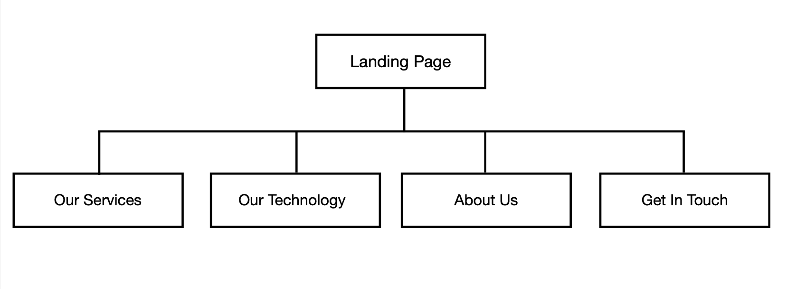
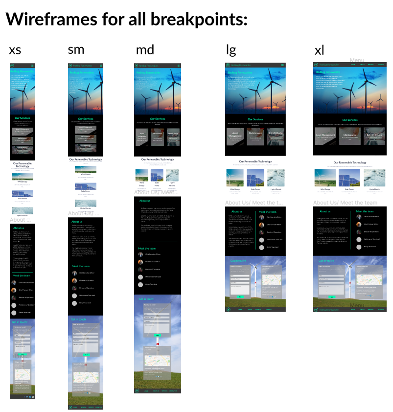
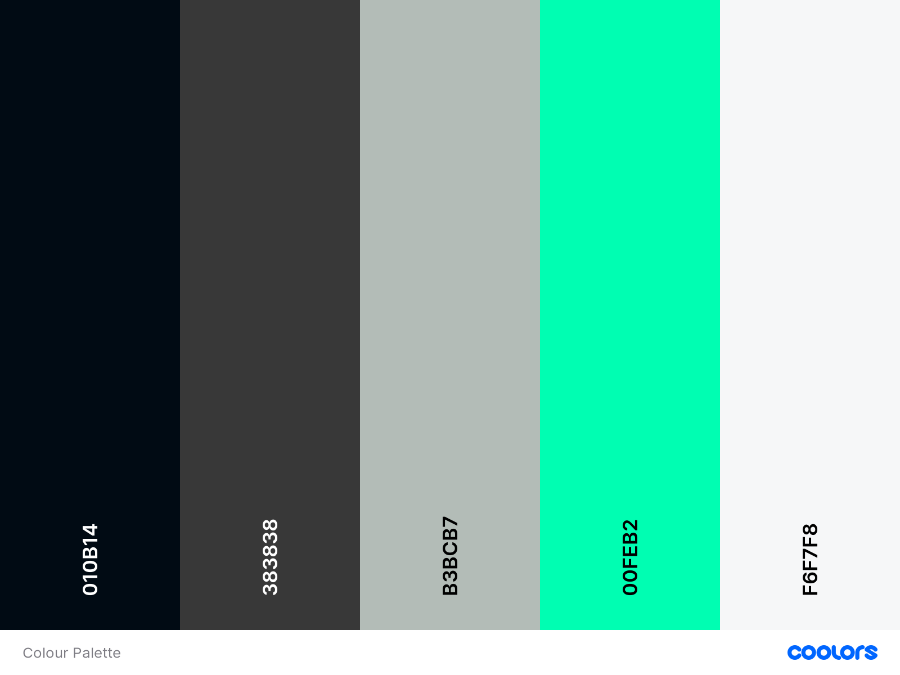
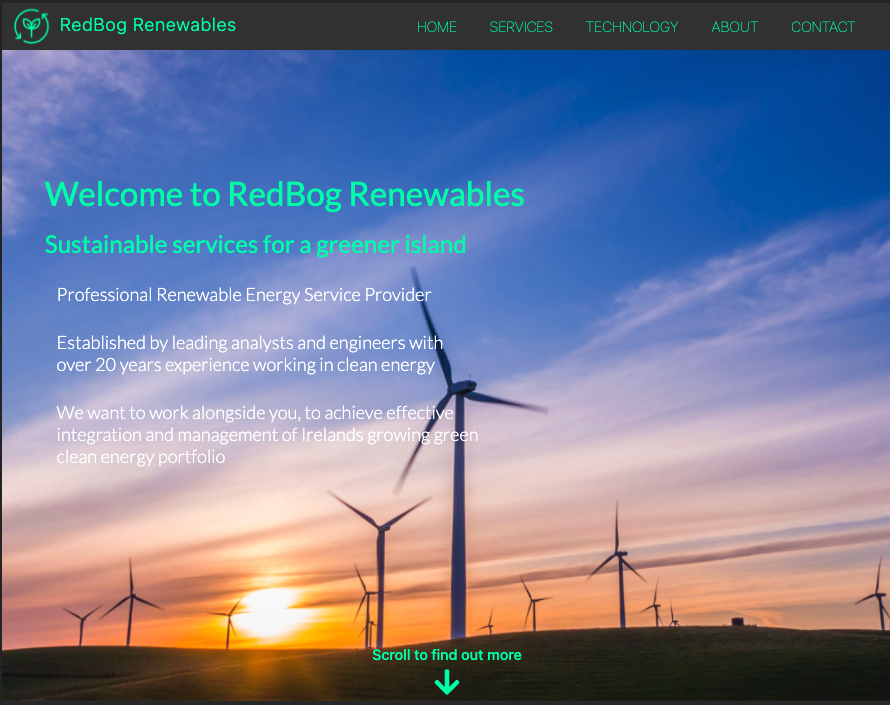
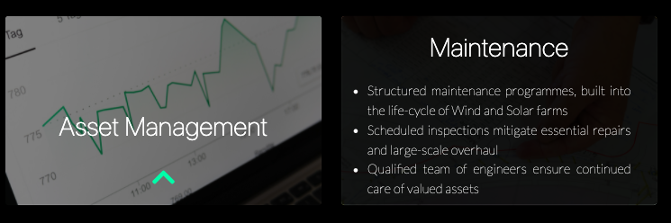
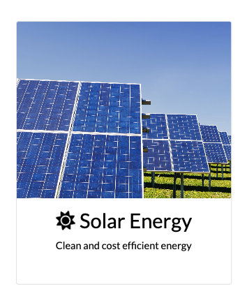
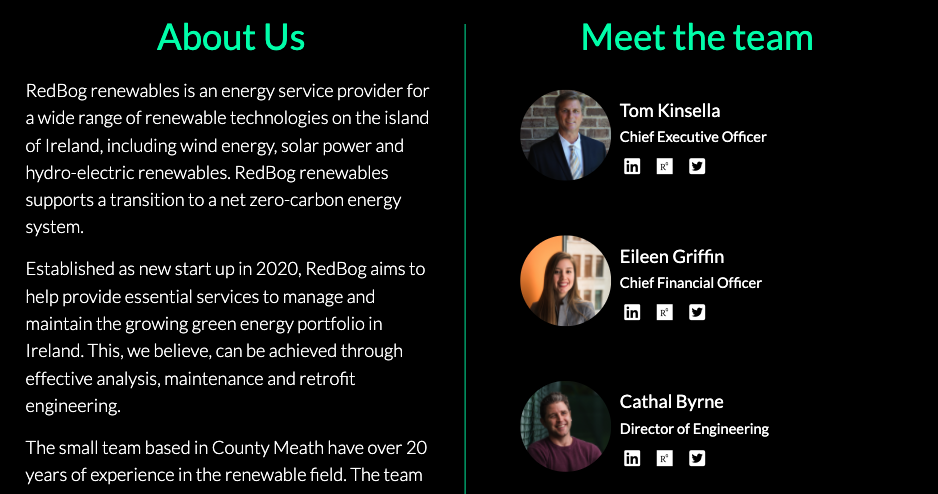
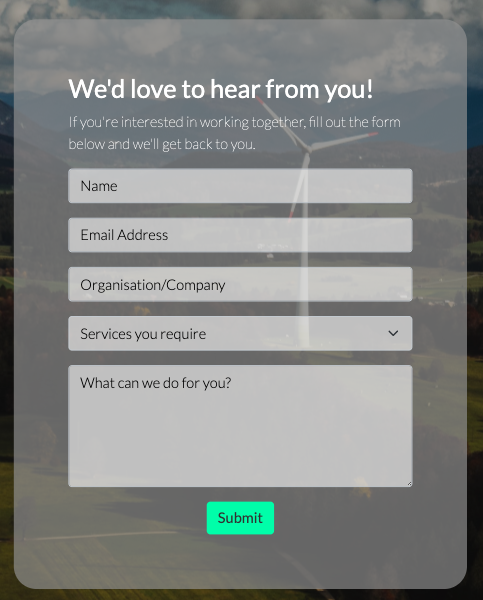
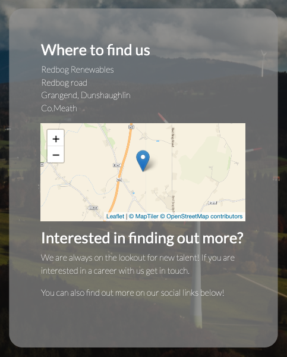

# RedBog Renewables
## Code Institute Milestone 1 Project
The project has been undertaken to promote a fictional start-up company named "RedBog Renewables". 
The project aims to give a professional and effective online presence to the start-up company, 
displaying the goals and XXXXXX that the organistaion wishes to portray. The website is broken down into distinct
sections that clearly define the services they provide, the XXXX and XXXXX. The basic design is done in a way
that will be familar to the user but showcases the professionalism and modern technology. 
The websites purpose is to present the start-up company as a professional, experienced and modern organisation 
ready to assist in the ever-growing market of renewable energy. 

# UX
## User Stories
----------------
__Business to Business__
- As a user, I would like to quickly and effectively understand the purpose of the website.
- As a user, I need to be able to easily navigate the page in a standard format.
- As a user, I would like to know what services the company provide.
- As a user, I need to understand that the company supports the technology relevant to my business.
- As a user, I would like to know about the history and experience of the company.
- As a user, I would appreciate the opportunity to "meet the team", with the ability to know more if I need to.
- As a user, I would like to contact the company, and quickly filter what service I am interested in.
- As a user, knowing where the company is located is important, will they be able to provide a service within reasonable time.
- As a user, I would like to use the site on mobile and desktop.  

__Prospective Employee__
- As a prospective job applicant, I need to know that the company operates in the relevant area of my skillset.
- As a prospective job applicant, I would like to know the specific technology in which this company has expertise.
- As a prospective job applicant, learning about the company prior to my application is important. 
- As a prospective job applicant, I would like to know that this company is open to recruitment.
- As a prospective job applicant, I require the ability to contact the company and register my interest in a career.
- As a prospective job applicant, links to the company social media is important, to find out if the company are active and what their latest news is.
- As a prospective job applicant, I need to know where the company is based. 

__Potential Investor__
- As a potential investor, I would like to see that the company is a new start-up company, open to investment.
- As a potential investor, I need to see that the company is operating a service in a new emerging marketplace.
- As a potential investor, knowing that the company has substantial experience in the relevant areas is important.
- As a potential investor, I would like the ability to contact the company and initate communication relevant to my investment opportunity.

__Returning Users__
- As a returning user, I would like to be able to quickly navigate to a specific area of the site. i.e Go directly to the contact page.
- As a returning user, I need to be able to gain more information about relevant services that had not been identified on the first visit to the site.

## Strategy
----------------
__Project goals__

The aim of this project is to build a site for a fictional start-up company and enable the company to create a professional and effective online presence. 
It was important for me to create a user-friendly and modern design site, that in effect inticed the user to discover more about the content
and in turn learn about the company. Overall, it was imperative to display information and content relevant to the company through well structured design,
positive imagery and colour. 

With regard to the content of the site, I aimed to answer four key questions that the company wanted users to be able to answer on landing and navigating the site.
- **_What_** are the services that company provide?
- **_Why_** would we choose this company, are they working within our specific area of expertise? 
- **_How_** will this company help our needs? **_How_** much experience do they have? 
- **_Where_** are the company based, are they operating on the island of Ireland?
 
__User goals__ 

The customer or users goals will be met by answering the questions posed earlier. The users want an informative, responsive and efficient website.
The users want basic information with an opportunity to learn more if they wish. This will be achieved through easily digestible snippets of text, combined 
with modern imagery to re-enforce the information.  

To ensure the natural key users needs are net, the page will be a single-scroll page with fixed navigation to specific areas.
This will be a modern but standard format in order to achieve user goal of an easy-to-use page. 

__Industry Research__

As part of the project conception, a task was undertaken to understand the current trends of web design for companies operating in the field. 
During the research a number of companies were found that provide similar services to the fictional company. They include:

A number of common themes appeared during my research. The sites were simple in design and layout, offering a clear definition 
of the services provided by the company and the relevant fields in which they operated. The sites utilised high quality imagery of large
landscapes and bright colours throughtout their pages. There was simple use of icons and text, with large paragraphs of text avoided.
Throughout the sites there were opportunites to link directly to get in contact or to learn more about the organisation. Some of the sites 
information appeared dis-jointed and the structure of containers asymmetric in design. This aspect of the sites was unappealing as a user, and for that reason I was keen to avoid overly complicated layouts.

## Scope 
----------------

Based on the strategy of the project, a number of practical requirements were laid out. It should be noted, that content in the project is constrained due to the fact that company is fictional
and the depth of knowledge acquired from research of the field is limited. The scope therefore includes:
- Basic and simplified information about the company and the services they provide.
- An overview of energy technology the company is assumed to have an understanding of.
- A brief history and description of the organistaion, with a "Meet the team" section of assumed roles a similar organistion might have.
- A contact form for the company.
- A interactive map of company location.
- Fixed navigation bar for desktop and collapsable burger menu for tablet and mobile.
- Download links for more information.
- Links to relevant social media for senior professional roles and general organisation. 

## Structure
----------------

The structure of the page is formed around a single page scrolling design, with fixed sticky navbar that collapses to burger menu on 
tablet and desktop. The website is split into five separate sections, that are simple to navigate and clear to understand.

1. **Landing Page**
- Simple landing page, with large landscape background image featuring the relevant technology used by the company. 
The content features a simple slogan and a brief description. At the bottom of the page there will be a "scroll to find out more" and interactive arrow icon. 
This feature will intice the user to find out more. 
2. **Our Services**
- This section holds the relevant information that each user-story wants answered. 
The section is introduced by simple paragraph. The services are broken into three respective stand-alone elements.
Interactive hover on sections and a link to download further information.

3. **Our Technology**
- Simple layout of technology the company operates with. Interactive icons and imagery to re-enforce company goals and add to modern user-friendly site.

4. **About Us**
- Two element page, with "About Us" and "Meet the team". The about section outlines the aims of company, the history and the experience the team members have in the industry.
The team area includes the image of the character, their name, title and relevant social media links. The team members only include department heads, as during
research it was found that was the industry norm. 

5. **Get In Touch**
- This section will enable the user to quickly get directly in contact the company for services, careers or investment. 
- The section will also feature an interactive map of the location of the company and links to social media.

6. **Information Architecture**

## Skeleton 
----------------
### **Wireframes** ###

The Skeleton of the project design was built utilising [Figma](https://www.figma.com/design-systems/). A detailed design breakdown can be seen [here.](README_images/design_breakdown.png)
 
 The overall basic design breakpoints can be seen below:

The indicvaidual wireframes can be seen by following the links below:
- [Link]
- [Link]
- [Link]

### **Changes to initial wireframes** ###
A number of design edits were made throughout the project with the purpose of increased userability. 
- The 'Our Services' information cards were made that the bulk of text was not immediately available. 
The user would have to reveal more specific information about the service by hovering over each card. 
This ensured the information and content is more disgestable and not overwhelming when the user arrives on the section. 

- The images used in the wireframes were replaced with high quality and more fitting landscape photos.

- The footer was simplified to include only the company logo, social links and copyright information. 

## Surface 
----------------
The look and feel of the site was clear from design conception. The modern feel required a dark toned site with bright punchy colours for 
headings and navigation. The dark background ensured the content and text of the site was clear and discernible from background images or content. 

The company operates in an advanced engineering field with specific reference to the idea of 'green and clean' energy. Therefore, it was important to include the colour green, and it be a significant and prominent
feature of the site. 

**Colour Theme**

**Typography**

# Features 
----------------

## 1. Navigation
The navigation is a fixed sticky top navbar with links to different sections of the single scroll page. The colour used is 
a dark grey which allows the brand logo and nav items to stand out. The logo and brand name is presented on the far-left side of the navbar and the section
headings on the far right. As the breakpoints decrease, the navbar transitions to a burger menu. The burger menu is a dropdown menu aligned to the right-hand side of the screen. 
To match the theme, the burger menu icon is green #00FEB2. 

I wanted to keep the design simple but interactive. When a user hovers over each nav item the colour fades to a white light colour.
The logo and brand name also act as a nav-link to the landing page, as is standard in modern web-design.

When the navbar is in the collapsed format and the user makes a selection, the page will navigate to the relevant section and
the navigation will close automatically. This was an important feature to add to the project as it supports user-friendly design and
the mobile first concept. I utilised javascript code found [here](link) to complete this task.

----------------
## 2. Landing Page

The landing page features a large landscape photo with wind turbines operating in the background. Immediately the user is aware that
the company specialises in an important type of technology. The user is welcomed by bright bold heading text and a short but effective
slogan underneath. The slogan perfectly defines the important elements the company wishes to portray. 

After the introduction there is some brief text outlining the experience and aims of the company. This is light text and easy to 
disgest for the user. The white colour and font size allows clear reading for the user.

The base of the page features a moving chevron down icon with 'scroll to find out more' text above. This engages the user and adds to 
the website flow and user-friendly design.

----------------
## 3. Our Services

The key feature of this section is three containers each representing a service of the company. The containers feature the service title
and once hovered over reveal more detailed information about the service.

The service titles have a hint icon in order to suggest the user hover over them. The service description then appears from the base of 
the container. The purpose of this feature was to engage the user with the content and enable the user to learn more about the service
in a consumable way. 

The elements of the page are responsive and the font size and container size chage with different breakpoints.

The basic hover structure was found [here]() and the design heavily edited to fit the sites needs. 

---------------
## 4. Our Renewable Technology

---------------
## 5. About us / Meet the team

---------------
## 6. Get in touch 

---------------
# Accessibility

# Future Features

# Testing 
## Code Validators 
---------------
## Mobile First Responsive Elements 
--------------
## Manual Testing
--------------
## Bugs and Fixes 
--------------
# Deployment 

# Tools and Resources 

# Credits 
## Content
--------------
## Media 
--------------
## Acknowledgements
--------------